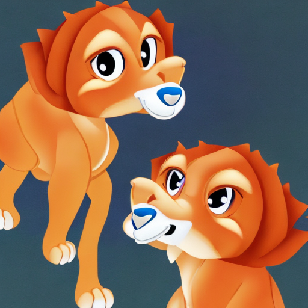

# KO-stable-diffusion-anything
**Diffusion-based korean text-to-image generation model** 
- 😍Anything: [](https://huggingface.co/kyujinpy/korean-stable-diffusion-anything)  
- 🤩Disney: [](https://huggingface.co/kyujinpy/korean-stable-diffusion-disney)
  
# Quick start
```
Korean_stable_diffuion_disney.ipynb # disney style
Korean_stable_diffuion_anything.ipynb # anime style
```
  
# Results
### KO-stable-diffusion-anything (🧨512x512)
<table class="center">
<tr>
  <td style="text-align:center;" colspan="4"><b>Output images</b></td>
</tr>
<tr>
  <td></td>
  <td></td>
  <td></td>              
  <td></td>
</tr>
<tr>
  <td width=25% style="text-align:center;">""</td>
  <td width=25% style="text-align:center;">"”</td>
  <td width=25% style="text-align:center;">""</td>
  <td width=25% style="text-align:center;">""</td>
</tr>
</table>
  
### KO-stable-diffusion-disney (🧨512x512)
<table class="center">
<tr>
  <td style="text-align:center;" colspan="4"><b>Output images</b></td>
</tr>
<tr>
  <td></td>
  <td></td>
  <td></td>              
  <td></td>
</tr>
<tr>
  <td width=25% style="text-align:center;">"황금빛 머리카락의 마법 공주, 모던한 디즈니 스타일"</td>
  <td width=25% style="text-align:center;">"아기 사자, 모던한 디즈니 스타일”</td>
  <td width=25% style="text-align:center;">"멋진 뉴욕 풍경, 모던한 디즈니 스타일"</td>
  <td width=25% style="text-align:center;">"아름다운 엘프, 모던한 디즈니 스타일"</td>
</tr>
</table>

# Pre-trained
```
(coming_soon...)
```

# TODO
- [ ] Make Colab code
- [ ] Share hugging face
- [ ] Share KO-stable-diffusion-anything
- [ ] Share KO-stable-diffusion-disney

# Acknowledgement
[Bingsu's CLIP](https://huggingface.co/Bingsu/clip-vit-large-patch14-ko)   
[SD-v2](https://github.com/Stability-AI/stablediffusion)   
[anything](https://huggingface.co/xyn-ai/anything-v4.0)  
[MO-DI-diffusion](https://huggingface.co/nitrosocke/mo-di-diffusion)
